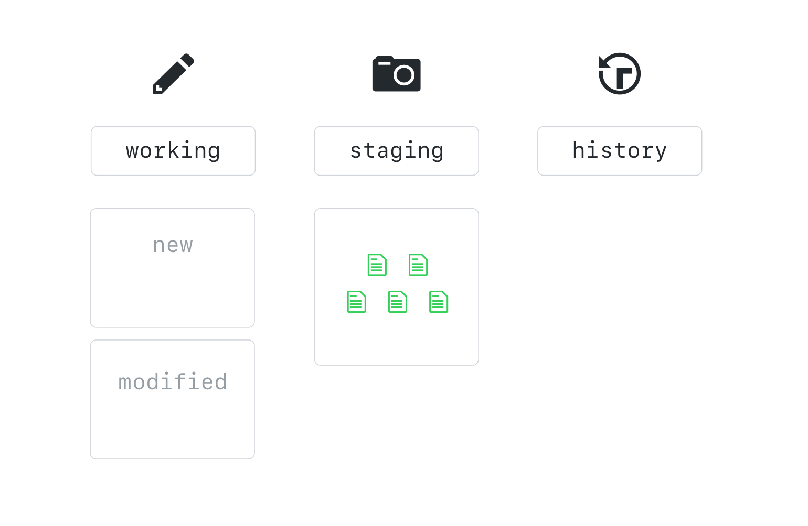
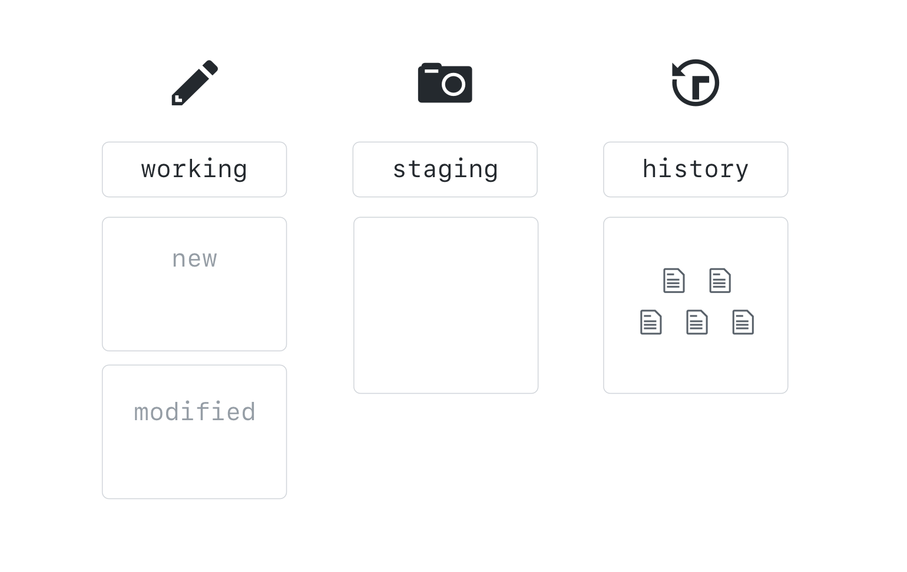

## Interne werking ##

Je bestanden worden opgeslaan in een repository. Deze repository bevat informatie over de inhoud van de bestanden, hun naam, locatie en de historiek.

* de inhoud van bestanden wordt opgeslaan in blob objecten
* de historiek wordt bijgehouden in commit objecten
* de structuur wordt bijgehouden in tree objecten

Wanneer je meerdere files hebt met dezelfde inhoud, dan zal in de tree meerdere keren verwezen worden naar hetzelfde blob object, waardoor er plaats bespaard wordt.

### Een commit in 2 delen (2 stages)

Nadat je een bestand gemaakt, hebt, is het tijd om een eerste 'snapshot' te maken van je repository.
Daarvoor moet je eerst het idee van een '2 stage commit' goed begrijpen.

In de context van softwareontwikkeling, verwijst '2 stage commit' meetal naar het proces van het bevestigen van veranderingen aan een code repository (bijvoorbeeld Git). Dit proces is onderverdeeld in twee fasen, waarbij de eerste fase de wijzigingen voorbereidt en de tweede fase de wijzigingen daadwerkelijk bevestigt.

#### 3 working trees

Git slaat alle informatie op in 3 'working trees'

* De "working tree" is de locatie op uw computer waar u uw bestanden bijwerkt en bewerkt voordat u wijzigingen aanbrengt in uw code repository. In GitHub kunnen we de working tree beschouwen als de lokale repository die u hebt gekloond van de centrale repository.

* De "staging area" of "index" is een tijdelijke opslagplaats waarin u de wijzigingen plaatst voordat u deze commit. In GitHub wordt de staging area vaak aangeduid als de "Changes" sectie van uw pull request. Dit is waar u de wijzigingen kunt bekijken voordat u ze samenvoegt met de hoofdbranch.

* De "commit history" is de lijst met alle commits die zijn gemaakt in uw repository. In GitHub wordt dit meestal weergegeven als een lijst met alle pull requests en commits in uw repository.
De eerste 'working' zijn de bestanden in jouw (lokale) map die niet gevolgd worden. Deze

#### 4 stadia van een bestand
Nu naar de vier stadia waarin een bestand zich kan bevinden:

* "Untracked" - Het bestand is nieuw en is nog niet toegevoegd aan de staging area.

* "Staged" - Het bestand is toegevoegd aan de staging area en zal worden opgenomen in de volgende commit.

* "Committed" - Het bestand is opgenomen in de commit history en bevindt zich in de hoofdbranch.

* Modified" - Het bestand is gewijzigd sinds de laatste commit en moet opnieuw worden toegevoegd aan de staging area en gecommit om de wijzigingen op te nemen in de commit history.
  

#### de '2-stage commit'
* Als we nieuwe bestanden maken zijn deze untracked, en worden deze toegevoegd aan de working tree.
* Als we bestaande bestanden aanpassen, worden ze 'modified' en worden ze ook toegevoegd aan de working tree

* Om deze toe te voegen aan versiecontrole, voegen we deze toe aan de staging area.
Dit is een afgebakend deel van ons werk dat we nu zullen bewerken.

Als we tevreden zijn met de aanpassingen, als deze getest zijn etcetera, kunnen we een commit doorvoeren. Dan komt deze commit in de 'history' map. 
De history wordt dus aangepast (uitgebreid), en de nieuwste versie van bestanden wordt de 'huidige' versie.

